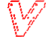
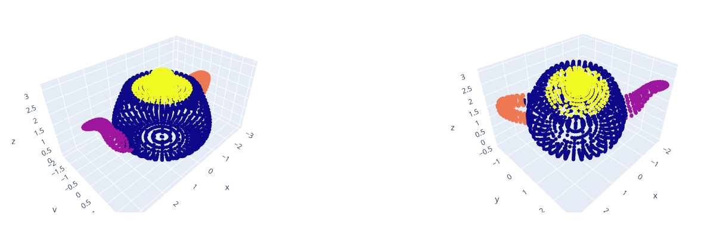

[](https://github.com/kumuji/volumentations/actions?workflow=Tests)
[](https://codecov.io/gh/kumuji/volumentations)
[](https://pypi.org/project/volumentations/)
[](https://volumentations.readthedocs.io/en/latest/?badge=latest)
[](https://github.com/ambv/black)
[](https://pepy.tech/project/volumentations)
[](https://www.codefactor.io/repository/github/kumuji/volumentations)
[](https://codeclimate.com/github/kumuji/volumentations/maintainability)


#  Volumentations




Python library for 3d data augmentaiton. Hard fork from [alumentations](https://github.com/albumentations-team/albumentations).

For more information on available augmentations check [documentation](https://volumentations.readthedocs.io/en/latest/index.html).

Or, check simple example in colab:
[](https://colab.research.google.com/drive/1CT9nIGME_M4kIDc3BfEF4pCb_8JdFLpH)

# Setup

`pip install volumentations`

# Usage example

```python
import volumentations as V
import numpy as np

augmentation = V.Compose(
    [
        V.Scale3d(scale_limit=(0.2, 0.2, 0.1), p=0.75),
        V.OneOrOther(
            V.Compose(
                [
                    V.RotateAroundAxis3d(
                        rotation_limit=np.pi, axis=(0, 0, 1), always_apply=True
                    ),
                    V.RotateAroundAxis3d(
                        rotation_limit=np.pi / 3, axis=(0, 1, 0), always_apply=True
                    ),
                    V.RotateAroundAxis3d(
                        rotation_limit=np.pi / 3, axis=(1, 0, 0), always_apply=True
                    ),
                ],
                p=1,
            ),
            V.Flip3d(axis=(0, 0, 1)),
        ),
        V.OneOf(
            [
                V.RandomDropout3d(dropout_ratio=0.2, p=0.75),
                V.RandomDropout3d(dropout_ratio=0.3, p=0.5),
            ]
        ),
    ]
)

augmented_teapot = augmentation(points=teapot.copy())["points"]
show_augmentation(teapot, augmented_teapot)
```
